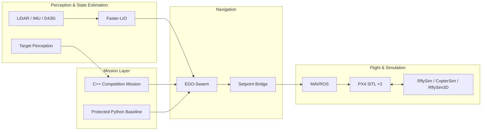

<div align="center">

# RflySim FutureCraft

### Multi-UAV Cooperative Navigation in Narrow Indoor Environments

An autonomous multi-UAV simulation and competition framework built with<br>
**RflySim · PX4 · ROS · Faster-LIO · EGO-Swarm · C++**

<p>
  <strong>English</strong>
  ·
  <a href="./README.zh-CN.md">简体中文</a>
</p>

<p>
  <a href="#demo">Demo</a> ·
  <a href="#architecture">Architecture</a> ·
  <a href="#quick-start">Quick Start</a> ·
  <a href="docs/current/competition-roadmap.md">Roadmap</a> ·
  <a href="docs/README.md">Documentation</a>
</p>


<sub>Concept visualization of the dual-UAV competition mission. Live validation claims are linked to recorded repository evidence below.</sub>

</div>

> [!IMPORTANT]
> Before modifying this repository, contributors and AI agents **must** read
> [AGENTS.md](AGENTS.md), [.agents/AGENT2READ.md](.agents/AGENT2READ.md), and—when working on the live RflySim/PX4/MAVROS/WSL chain—[.agents/RFLYSIM_TOOLCHAIN_REFERENCE.md](.agents/RFLYSIM_TOOLCHAIN_REFERENCE.md).

## Overview

RflySim FutureCraft is a dual-UAV research and competition platform for autonomous flight in narrow indoor environments. It connects a Windows/WSL simulation lifecycle with PX4 SITL, MAVROS, LiDAR/IMU sensing, Faster-LIO localization, EGO-Swarm planning, and project-owned mission logic.

The repository is organized around two goals:

- preserve a repeatable, evidence-backed simulation baseline; and
- incrementally develop the C++ competition mission without silently weakening flight safety or reopening frozen infrastructure.

The public project name is **RflySim FutureCraft**. Existing package and workspace names such as `future_aircraft_mission` remain unchanged.

## Competition Mission

The project targets Challenge 2.1 of the Future Aircraft Innovation Competition: cooperative navigation and operation by at least two autonomous aircraft in a narrow indoor course.

```text
Autonomous takeoff (≥2 UAVs)
        ↓
Enter a narrow, turning corridor
        ↓
Avoid static and dynamic obstacles
        ↓
Detect and coordinate work on unknown targets
        ↓
Traverse the course in an orderly manner
        ↓
Land precisely on ArUco-marked platforms
```

The complete mission must operate without manual piloting except for the explicitly permitted start and emergency-stop actions. See the [official competition guide](docs/reference/competition-guide-2026.pdf) and the [competition capability roadmap](docs/current/competition-roadmap.md) for authoritative requirements and acceptance criteria.

## Demo

The frozen simulation baseline includes dual PX4/MAVROS instances, dual Faster-LIO localization, EGO-Swarm planning, OFFBOARD flight, corridor traversal, landing, and controlled lifecycle closure.

<p align="center">
  
  
</p>

<p align="center"><sub>Narrow-corridor flight · Dual-UAV operation</sub></p>

<p align="center">
  
</p>

<p align="center"><sub>Actual RflySim capture showing both aircraft and raised course obstacles</sub></p>

| Demonstrated result | Evidence |
| --- | --- |
| Protected PBL-1 full-stack flight | [3× fresh-instance regression closure](docs/evidence/2026-08-08-pbl1-fullstack-regression-closure.md) |
| Current parameter and flight-plan stability | [4× fresh armed verification](docs/evidence/2026-08-20-current-params-4x-fresh-arm-verified.md) |
| Competition Course V2 world and motion gate | [Map-ready closure](docs/evidence/2026-09-01-competition-course-v2-map-ready-closure.md) |
| UAV1 Section A repeatability | [3/3 fresh flight-chain PASS](docs/evidence/2026-09-02-v2-section-a-repeatability-clearance-not-stable.md) |

> [!NOTE]
> Section A flight is repeatable, but its entrance wall clearance (approximately 0.072–0.085 m) remains below the 0.25 m stability target. This is a planner/corridor-entry performance backlog, not evidence that the full competition mission is complete.

## Architecture



The C++ mission layer decides **what** the aircraft should do; EGO-Swarm decides **how** to navigate locally. The existing `EgoSetpointBridge` is part of the retained baseline. The broader `VehicleInterface → EgoInterface → UavAgent → MissionManager` architecture is a roadmap concept and is **not yet implemented**.

## Current Capabilities

Status reflects the [simulation freeze handoff](docs/current/2026-09-02-simulation-baseline-freeze-handoff.md), not an unverified claim of competition readiness.

| Capability | Status | Notes |
| --- | --- | --- |
| Manifest-based lifecycle and ownership | **Frozen baseline** | Start, readiness, inspection, and controlled stop are evidence-backed and fail closed. |
| Dual RflySim / PX4 SITL / MAVROS | **Validated** | Two-vehicle topology and flight chain are established. |
| LiDAR/IMU + Faster-LIO | **Validated baseline** | `lidar_only` remains the default flight configuration. |
| EGO-Swarm local planning and setpoint handoff | **Validated baseline** | Retained as protected infrastructure. |
| Competition Course V2 | **Frozen / map ready** | Static geometry, pendulum motion, and world-state probes passed. |
| UAV1 Section A flight chain | **3/3 fresh PASS** | Clearance stability remains an explicit limitation. |
| C++ competition mission | **Active next phase** | Existing package and bridge retained; broader mission architecture is not implemented. |
| RGB/depth competition perception | **Experimental / scaffold** | Not a hard dependency of the protected flight baseline. |
| Multi-UAV target operation and ArUco landing | **Planned** | Full competition capability is not yet implemented. |
| Real-world deployment | **Planned** | Human-controlled arming and Offboard authorization remain mandatory. |

## Tech Stack

| Layer | Technologies |
| --- | --- |
| Simulation and flight | RflySim, CopterSim, RflySim3D, PX4 SITL, MAVROS |
| Localization and sensing | Faster-LIO, LiDAR, IMU, optional D435i RGB/depth |
| Planning and control | EGO-Swarm, ROS, OFFBOARD setpoint handoff |
| Mission development | C++17, Python, ROS packages and launch files |
| Tooling and orchestration | PowerShell, Windows, WSL, deterministic manifests and validators |

## Repository Structure

```text
RflySim-FutureCraft/
├── AGENTS.md                                  # Mandatory safety and ownership rules
├── .agents/
│   ├── AGENT2READ.md                          # Current truth and engineering entry guide
│   └── RFLYSIM_TOOLCHAIN_REFERENCE.md         # Live toolchain boundaries
├── config/                                    # Environment, sensors, stages, and course specs
├── docs/                                      # Current state, architecture, evidence, incidents
├── future_aircraft_ws/src/
│   ├── future_aircraft_mission/               # Human-owned C++ competition mission workspace
│   └── multi_uav_mission/                     # Protected Python/launch flight baseline
├── scripts/                                   # CLI, lifecycle, diagnostics, and validation
├── tests/                                     # Offline contract and regression checks
├── third_party/ego-planner-swarm/             # Pinned team-fork Catkin overlay
└── sim.ps1                                    # Main project command entry point
```

Runtime evidence in `logs/` and deterministic outputs in `generated/` are intentionally ignored by Git. Their paths still belong to protected runtime contracts and must not be casually renamed or repurposed.

## Quick Start

### Prerequisites

- Windows with the project-compatible RflySim/PX4 toolchain
- WSL with the required ROS workspace dependencies
- PowerShell and the environment paths described in the [toolchain reference](.agents/RFLYSIM_TOOLCHAIN_REFERENCE.md)
- Repository submodules initialized where required

Start with read-only checks and dry runs:

```powershell
# Inspect the local environment
.\sim.ps1 doctor

# Preview lifecycle actions; state changes require explicit -Execute
.\sim.ps1 start
.\sim.ps1 status
.\sim.ps1 stop
```

Build and run offline validation:

```powershell
.\sim.ps1 build
.\sim.ps1 validate -Suite mission
.\sim.ps1 validate -Suite core
```

The default `dev` profile prepares dual sensors, Faster-LIO readiness, and EGO-Swarm, but stops before mission execution, OFFBOARD mode, and arming. Never infer permission to arm from a successful dry run or offline validation.

## Roadmap

| Phase | Scope | Status |
| --- | --- | --- |
| 0 | Safe engineering foundation and lifecycle | **Closed / frozen** |
| 1 | Protected dual-UAV full-stack baseline | **Closed** |
| 2 | Competition Course V2 and Section A baseline | **Frozen; clearance backlog retained** |
| 2.5 | Incremental C++ competition mission | **Next active phase** |
| 3 | Multi-UAV corridor coordination | Planned |
| 4 | Competition perception | Planned |
| 5 | Cooperative target operation | Planned |
| 6 | Precision exit and ArUco landing | Planned |
| 7 | Full competition mission integration | Planned |
| 8 | Score, reliability, and competition-day optimization | Planned |

Do not use **competition ready** until a fresh, recorded end-to-end mission passes the acceptance criteria. Detailed milestones and dependencies live in the [competition roadmap](docs/current/competition-roadmap.md).

## Documentation

| Entry | Purpose |
| --- | --- |
| [Documentation index](docs/README.md) | Navigation across current state, architecture, evidence, incidents, decisions, and references |
| [Current agent truth](.agents/AGENT2READ.md) | Authoritative handoff, truth priority, and debugging workflow |
| [Simulation freeze handoff](docs/current/2026-09-02-simulation-baseline-freeze-handoff.md) | Frozen scope, accepted baseline, limitations, and next phase |
| [Competition roadmap](docs/current/competition-roadmap.md) | Requirements, capability gaps, phases, and evidence mapping |
| [Lifecycle architecture](docs/architecture/2026-08-08-live-stack-lifecycle-design.md) | Manifest ownership and safe lifecycle design |
| [Script index](scripts/README.md) | Supported entry points, internals, diagnostics, and retired hazards |

Only the root README, `AGENTS.md`, `.agents/AGENT2READ.md`, and documents explicitly marked current can define current project truth. Historical evidence and incident reports provide context but do not independently reopen resolved blockers.

## Safety

> [!WARNING]
> This repository can control simulated—and potentially real—aircraft. A passing offline check does not authorize live execution, OFFBOARD mode, or arming.

<details>
<summary><strong>Read the non-negotiable live-operation rules</strong></summary>

- Use only the manifest-based lifecycle entry points for live stack operations.
- Unknown or stale ownership, ambiguous ports, or an unclean stop must fail closed: report the condition and stop; do not force-retry.
- Never restore the retired behavior in `scripts/cleanup_sim_stack.ps1` or `scripts/restart_live_stack.ps1`; these files are hazard tombstones that must continue to fail.
- Do not use process-name sweeps, `wsl --shutdown`, automatic hard-restart loops, or implicit arming.
- Simulation arming is allowed only when the current run passes readiness and the caller explicitly provides `--simulation-only` and `--allow-arm`, with a matching run/instance identity and an enabled policy.
- Real aircraft must always be armed by a human, and a human must authorize Offboard operation.
- Executing a real stack stop, forced PGID termination, fresh-instance execution, or first live lifecycle validation requires the explicit authorization defined in [AGENTS.md](AGENTS.md).

</details>

## Development & Agent Guidelines

Do not read this README and start changing code. Establish context in this order:

1. [AGENTS.md](AGENTS.md)
2. [.agents/AGENT2READ.md](.agents/AGENT2READ.md)
3. [.agents/RFLYSIM_TOOLCHAIN_REFERENCE.md](.agents/RFLYSIM_TOOLCHAIN_REFERENCE.md) for RflySim/PX4/MAVROS/WSL work
4. Task-relevant documents under `docs/`
5. Current implementation, configuration, tests, and run-scoped artifacts
6. Historical incidents only when necessary

Ownership and change boundaries:

- Humans own competition behavior, mission strategy, and control intent under `future_aircraft_mission` by default.
- Agents may maintain project-owned orchestration, maps, adapters, diagnostics, maintenance tooling, documentation, and tests within the rules.
- ROS interfaces, launch composition, package manifests, lifecycle/launcher code, third-party planning code, and anything that can affect PBL-1 are change-gated shared boundaries.
- The `multi_uav_mission` Python/launch baseline and lifecycle internals are frozen unless fresh regression evidence justifies reopening them.
- Any gated change must state the evidence, impact, risk, rollback, and validation plan before implementation.

Validation for documentation and repository-structure changes:

```powershell
D:\PX4PSP\Python38\python.exe tests\script_inventory_check.py --project-root .
D:\PX4PSP\Python38\python.exe tests\docs_link_check.py --project-root .
powershell -ExecutionPolicy Bypass -File scripts\validate_repository.ps1
```

Offline PASS is not live PASS. If no fresh live run was performed, say so explicitly.

## Acknowledgements

This project builds on the RflySim simulation platform, PX4, ROS/MAVROS, Faster-LIO, EGO-Swarm, and the broader open-source aerial robotics community. Competition requirements are derived from the official Future Aircraft Innovation Competition materials included in the repository.

---

<div align="center">

**Research carefully. Validate honestly. Fly safely.**

</div>
