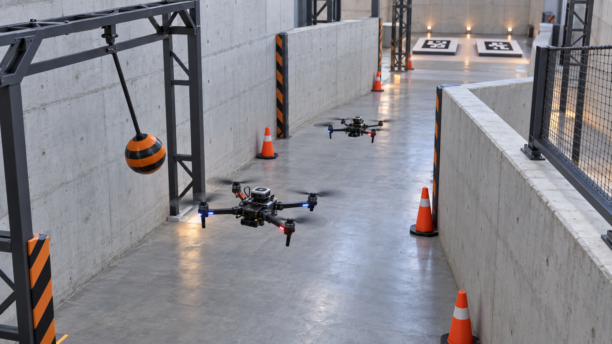
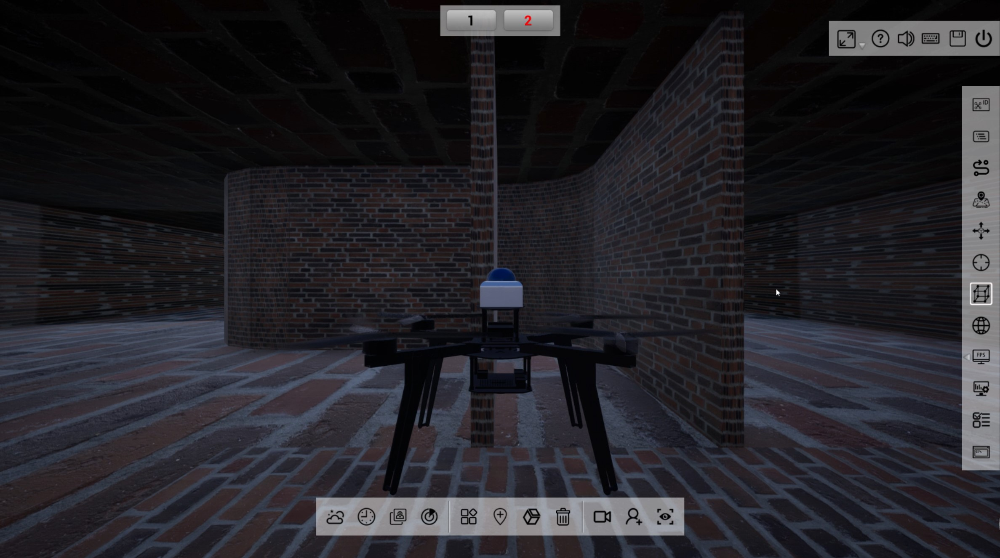
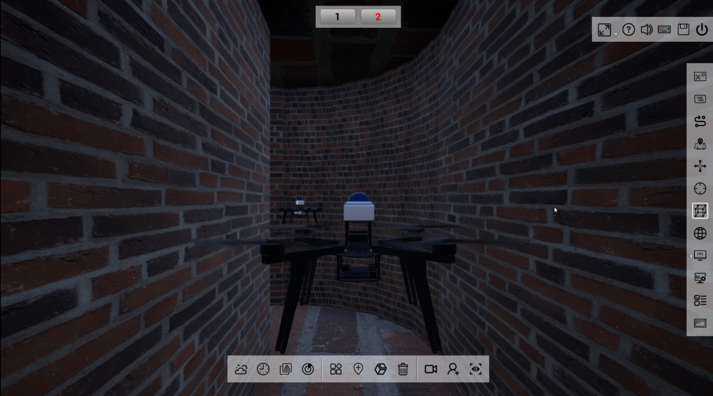
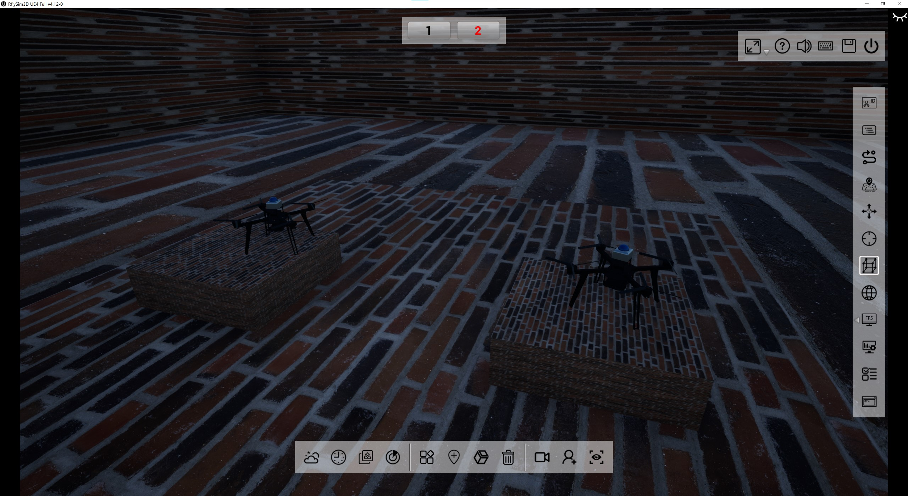
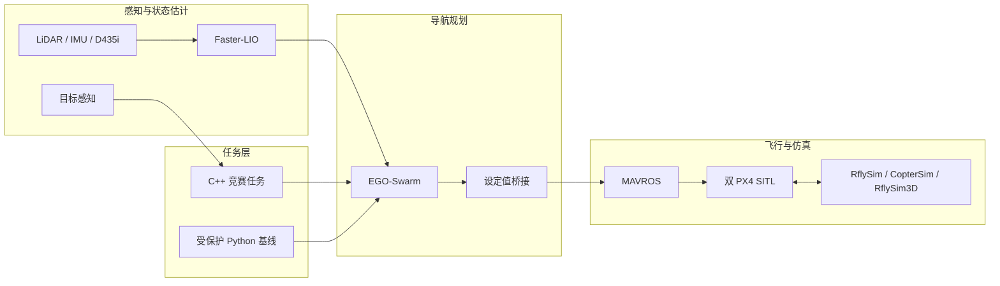

<div align="center">

# RflySim FutureCraft

### 面向室内狭窄环境的多无人机协同导航系统

基于 **RflySim · PX4 · ROS · Faster-LIO · EGO-Swarm · C++**<br>
构建的多无人机自主仿真与竞赛任务框架

<p>
  <a href="./README.md">English</a>
  ·
  <strong>简体中文</strong>
</p>

<p>
  <a href="#仿真演示">仿真演示</a> ·
  <a href="#系统架构">系统架构</a> ·
  <a href="#快速开始">快速开始</a> ·
  <a href="docs/current/competition-roadmap.md">开发路线</a> ·
  <a href="docs/README.md">项目文档</a>
</p>



<sub>双无人机竞赛任务概念效果图；所有实机链路验证结论均以下方链接的仓库证据为准。</sub>

</div>

> [!IMPORTANT]
> 在修改本仓库前，开发者与 AI Agent **必须**阅读 [AGENTS.md](AGENTS.md)、[.agents/AGENT2READ.md](.agents/AGENT2READ.md)；涉及 RflySim/PX4/MAVROS/WSL 运行链时，还必须阅读 [.agents/RFLYSIM_TOOLCHAIN_REFERENCE.md](.agents/RFLYSIM_TOOLCHAIN_REFERENCE.md)。

## 项目简介

RflySim FutureCraft 是一个面向室内狭窄环境自主飞行研究与竞赛任务的双无人机平台。项目将 Windows/WSL 仿真生命周期、PX4 SITL、MAVROS、LiDAR/IMU、Faster-LIO 定位、EGO-Swarm 规划与项目自有任务逻辑连接为一条完整工程链路。

仓库围绕两个核心目标组织：

- 保护可重复、有证据支撑的仿真基线；
- 在不弱化飞行安全、不随意重开冻结基础设施的前提下，增量开发 C++ 竞赛任务。

对外展示名称统一为 **RflySim FutureCraft**；`future_aircraft_mission` 等现有包名与工作区名称保持不变。

## 竞赛任务

本项目面向未来飞行器创新大赛赛题 2.1：不少于两架自主飞行器在室内狭窄通道环境下完成协同导航与作业。

```text
不少于两架无人机自主起飞
        ↓
进入狭窄且带转弯的通道
        ↓
避开静态与动态障碍物
        ↓
识别未知目标并协同作业
        ↓
有序穿越完整比赛通道
        ↓
在 ArUco 标记平台上精准降落
```

除规则明确允许的启动与急停外，完整任务不得依赖人工遥控。权威要求与验收标准请查阅[正式参赛指南](docs/reference/competition-guide-2026.pdf)和[竞赛能力开发路线图](docs/current/competition-roadmap.md)。

## 仿真演示

当前冻结仿真基线包含双 PX4/MAVROS、双 Faster-LIO 定位、EGO-Swarm 规划、OFFBOARD 飞行、通道穿越、降落和受控生命周期闭环。

<p align="center">
  
  
</p>

<p align="center"><sub>狭窄通道飞行 · 双无人机协同运行</sub></p>

<p align="center">
  
</p>

<p align="center"><sub>同时展示两架飞行器与抬高赛道障碍的真实 RflySim 截图</sub></p>

| 已验证结果 | 证据 |
| --- | --- |
| PBL-1 受保护全栈飞行基线 | [3 次 fresh-instance 回归闭环](docs/evidence/2026-08-08-pbl1-fullstack-regression-closure.md) |
| 当前参数与飞行计划稳定性 | [4 次 fresh 解锁飞行验证](docs/evidence/2026-08-20-current-params-4x-fresh-arm-verified.md) |
| Competition Course V2 场景与运动验收 | [地图就绪闭环](docs/evidence/2026-09-01-competition-course-v2-map-ready-closure.md) |
| UAV1 Section A 可重复性 | [3/3 fresh 飞行链通过](docs/evidence/2026-09-02-v2-section-a-repeatability-clearance-not-stable.md) |

> [!NOTE]
> Section A 飞行链已具备可重复性，但入口壁面净空约为 0.072–0.085 m，仍低于 0.25 m 稳定目标。该问题属于规划器/通道入口性能待办，不能据此宣称完整比赛任务已经完成。

## 系统架构



C++ 任务层决定飞行器“做什么”，EGO-Swarm 决定局部“如何到达”。现有 `EgoSetpointBridge` 属于必须保留的基线模块。更完整的 `VehicleInterface → EgoInterface → UavAgent → MissionManager` 架构仍是路线图概念，**尚未实现**。

## 当前能力

下表以[仿真冻结交接文档](docs/current/2026-09-02-simulation-baseline-freeze-handoff.md)为准，不代表未经验证的“比赛就绪”声明。

| 能力 | 状态 | 说明 |
| --- | --- | --- |
| 基于 manifest 的生命周期与归属管理 | **冻结基线** | 启动、就绪、检查和受控停止均有证据支撑，并采用失败关闭策略。 |
| 双 RflySim / PX4 SITL / MAVROS | **已验证** | 双机拓扑与飞行链已建立。 |
| LiDAR/IMU + Faster-LIO | **已验证基线** | `lidar_only` 仍是默认飞行配置。 |
| EGO-Swarm 局部规划与设定值链路 | **已验证基线** | 作为受保护基础设施继续保留。 |
| Competition Course V2 | **冻结 / 地图就绪** | 静态几何、摆动障碍和场景状态探针已经通过。 |
| UAV1 Section A 飞行链 | **3/3 fresh 通过** | 净空稳定性仍是明确保留的限制。 |
| C++ 竞赛任务 | **下一活跃阶段** | 保留现有包与桥接模块；更完整任务架构尚未实现。 |
| RGB/Depth 竞赛感知 | **实验 / 接口脚手架** | 不是受保护飞行基线的硬依赖。 |
| 多机目标协同与 ArUco 降落 | **计划中** | 完整比赛能力尚未实现。 |
| 真机部署 | **计划中** | 解锁与 Offboard 授权必须始终由人类执行。 |

## 技术栈

| 层级 | 技术 |
| --- | --- |
| 仿真与飞行 | RflySim、CopterSim、RflySim3D、PX4 SITL、MAVROS |
| 定位与传感 | Faster-LIO、LiDAR、IMU、可选 D435i RGB/Depth |
| 规划与控制 | EGO-Swarm、ROS、OFFBOARD 设定值链路 |
| 任务开发 | C++17、Python、ROS 包与 launch 文件 |
| 工具与编排 | PowerShell、Windows、WSL、确定性 manifest 与验证器 |

## 仓库结构

```text
RflySim-FutureCraft/
├── AGENTS.md                                  # 强制安全与职责规则
├── .agents/
│   ├── AGENT2READ.md                          # 当前事实与工程入口指南
│   └── RFLYSIM_TOOLCHAIN_REFERENCE.md         # live 工具链边界
├── config/                                    # 环境、传感器、阶段与赛道规范
├── docs/                                      # 当前状态、架构、证据与事故记录
├── future_aircraft_ws/src/
│   ├── future_aircraft_mission/               # 人类所有的 C++ 竞赛任务工作区
│   └── multi_uav_mission/                     # 受保护的 Python/launch 飞行基线
├── scripts/                                   # 入口、生命周期、诊断与验证
├── tests/                                     # 离线契约与回归检查
├── third_party/ego-planner-swarm/             # 固定 team-fork Catkin overlay
└── sim.ps1                                    # 项目统一命令入口
```

`logs/` 中的运行证据与 `generated/` 中的确定性生成物不会提交到 Git，但其路径仍属于受保护运行契约，不得随意改名或复用。

## 快速开始

### 环境前提

- Windows 与项目兼容的 RflySim/PX4 工具链
- WSL 与所需 ROS 工作区依赖
- PowerShell，以及[工具链参考](.agents/RFLYSIM_TOOLCHAIN_REFERENCE.md)定义的环境路径
- 按需完成仓库子模块初始化

首先执行只读检查和 DryRun：

```powershell
# 检查本地环境
.\sim.ps1 doctor

# 预览生命周期操作；状态变更必须显式使用 -Execute
.\sim.ps1 start
.\sim.ps1 status
.\sim.ps1 stop
```

构建并运行离线验证：

```powershell
.\sim.ps1 build
.\sim.ps1 validate -Suite mission
.\sim.ps1 validate -Suite core
```

默认 `dev` 配置会准备双传感器、Faster-LIO readiness 与 EGO-Swarm，但停在任务执行、OFFBOARD 和解锁之前。DryRun 或离线验证通过不能推导为解锁许可。

## 开发路线

| 阶段 | 范围 | 状态 |
| --- | --- | --- |
| 0 | 安全工程基础与生命周期 | **关闭 / 冻结** |
| 1 | 双无人机受保护全栈基线 | **关闭** |
| 2 | Competition Course V2 与 Section A 基线 | **冻结；保留净空待办** |
| 2.5 | 增量开发 C++ 竞赛任务 | **下一活跃阶段** |
| 3 | 多无人机通道协同 | 计划中 |
| 4 | 竞赛目标感知 | 计划中 |
| 5 | 协同目标作业 | 计划中 |
| 6 | 精准出通道与 ArUco 降落 | 计划中 |
| 7 | 完整比赛任务集成 | 计划中 |
| 8 | 得分、可靠性与赛场流程优化 | 计划中 |

在完整任务按照验收标准完成 fresh 实例端到端验证并保留证据之前，不得使用“比赛就绪”表述。详细里程碑和依赖关系见[竞赛路线图](docs/current/competition-roadmap.md)。

## 项目文档

| 入口 | 用途 |
| --- | --- |
| [文档总索引](docs/README.md) | 当前状态、架构、证据、事故、决策与参考资料导航 |
| [Agent 当前事实](.agents/AGENT2READ.md) | 权威交接、事实优先级与调试工作流 |
| [仿真冻结交接](docs/current/2026-09-02-simulation-baseline-freeze-handoff.md) | 冻结范围、接受基线、已知限制与下一阶段 |
| [竞赛路线图](docs/current/competition-roadmap.md) | 赛题要求、能力缺口、阶段与证据映射 |
| [生命周期架构](docs/architecture/2026-08-08-live-stack-lifecycle-design.md) | manifest 归属与安全生命周期设计 |
| [脚本索引](scripts/README.md) | 支持入口、内部实现、诊断工具与退役危险脚本 |

只有根 README、`AGENTS.md`、`.agents/AGENT2READ.md` 与明确标记为当前状态的文档能够定义 Current Truth。历史证据与事故记录用于提供上下文，不能单独把已关闭问题重新提升为当前阻塞项。

## 安全说明

> [!WARNING]
> 本仓库可以控制仿真飞行器，并可能连接真实飞行器。离线检查通过不等于获得 live 执行、OFFBOARD 或解锁权限。

<details>
<summary><strong>展开查看不可绕过的 live 操作规则</strong></summary>

- 所有 live stack 操作必须使用 manifest 化生命周期入口。
- 遇到 unknown/stale ownership、端口歧义或 stop-clean 失败时必须 fail closed：只报告并停止，不得强制重试。
- 不得恢复 `scripts/cleanup_sim_stack.ps1` 与 `scripts/restart_live_stack.ps1` 的旧行为；它们是必须保持恒失败的 hazard tombstone。
- 禁止名称扫杀、`wsl --shutdown`、自动硬重启循环和隐式解锁。
- 仿真解锁仅在当前 run readiness 通过、调用方显式提供 `--simulation-only` 与 `--allow-arm`、run/instance 身份匹配且策略允许时执行。
- 真机始终由人类解锁，Offboard 始终由人类授权。
- 执行真实 stack stop、强制 PGID 终止、fresh-instance execute 或第一次 live lifecycle 验证，必须取得 [AGENTS.md](AGENTS.md) 定义的明确授权。

</details>

## 开发与 Agent 规范

不得只阅读本 README 就直接修改代码。必须按以下顺序建立上下文：

1. [AGENTS.md](AGENTS.md)
2. [.agents/AGENT2READ.md](.agents/AGENT2READ.md)
3. 涉及 RflySim/PX4/MAVROS/WSL 时阅读 [.agents/RFLYSIM_TOOLCHAIN_REFERENCE.md](.agents/RFLYSIM_TOOLCHAIN_REFERENCE.md)
4. `docs/` 下与任务直接相关的文档
5. 当前实现、配置、测试与 run-scoped artifacts
6. 仅在必要时查阅历史事故记录

职责与修改边界：

- `future_aircraft_mission` 内的比赛行为、任务策略与控制意图默认由人类所有。
- Agent 可在规则内维护项目自有的仿真编排、地图、适配器、诊断、维护工具、文档及测试。
- ROS 接口、launch 组合、package manifest、lifecycle/launcher、第三方规划代码，以及任何可能影响 PBL-1 的文件，都属于 change-gated shared boundary。
- `multi_uav_mission` 的 Python/launch 基线与 lifecycle 内部实现保持冻结，除非 fresh regression evidence 证明必须重新打开。
- 进入受控边界前，必须先说明证据、影响面、风险、回滚和验证计划。

文档与仓库结构改动的验证命令：

```powershell
D:\PX4PSP\Python38\python.exe tests\script_inventory_check.py --project-root .
D:\PX4PSP\Python38\python.exe tests\docs_link_check.py --project-root .
powershell -ExecutionPolicy Bypass -File scripts\validate_repository.ps1
```

离线 PASS 不等于 live PASS；未执行 fresh live 时必须明确说明。

## 致谢

本项目基于 RflySim 仿真平台、PX4、ROS/MAVROS、Faster-LIO、EGO-Swarm，以及开源空中机器人社区的长期工作构建。竞赛任务要求来源于仓库内收录的未来飞行器创新大赛正式材料。

---

<div align="center">

**严谨研究，诚实验证，安全飞行。**

</div>
